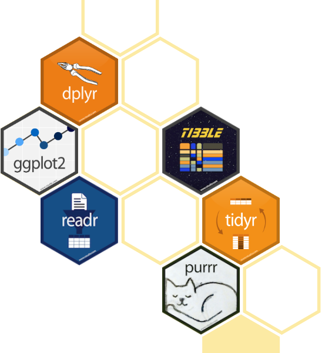

```{r init, include = FALSE, echo = FALSE}
library(knitr)
library(biometrics)
library(lubridate)
library(tidyverse)
library(kableExtra)

source("assets/R/hooks.R")

load("../data/dat.RData")

```

## Session Resources

All resources for this Introduction to R Worksop are available on GitHub: [https://github.com/TelethonKids/RWorkshop](https://github.com/TelethonKids/RWorkshop)

**Introduction to Data Manipulation**

Download the slides from this link: [https://github.com/TelethonKids/RWorkshop/tree/master/inst/doc/reproducable-research.html](https://github.com/TelethonKids/RWorkshop/tree/master/inst/doc/reproducable-research.html)

Download the Worked example from here:  [https://github.com/TelethonKids/RWorkshop/tree/master/R/03_data_manipulation](https://github.com/TelethonKids/RWorkshop/tree/master/R/03_data_manipulation)

# Session Overview

## Overview

>- Tidyverse
>- Introduction to Data Manipulation
>- Reading In Data
>- Data Classes
>- Cleaning and Data Wrangling
>- Summarising Data
>- Functions in R

# Tidyverse

## What is the Tidyverse?

<blockquote type = "blockquote">The Tidyverse is an opinionated collection of R packages designed for data science. All packages share an underlying design philosophy, grammar, and data structures.
<footer class="blockquote-footer">[https://www.tidyverse.org/](https://www.tidyverse.org/)</footer></blockquote>

&nbsp;

Install the complete Tidyverse collection in R (or RStudio) with:

```{r, eval = F, out}
install.packages("tidyverse")

```

## Tidyverse Packages

<div class = "col2">

```{r, echo = F, out.extra = "figure"}


```

<div style="display: inline-block;">
>- **dplyr**    (Data wrangling)
>- **ggplot2**  (Data visualisation)
>- **readr**    (Import raw data formats)
>- **tibble**   (Adds to <code>data.frame</code>)
>- **tidyr**    (Functions to reshape data)
>- **purrr**    (Functional programming tools)
</div>

</div>

## Overview of base *vs.* tidyverse [history/evolution]

TO DO

# Introduction to Data</br>Manipulation

## Worked Example

Download the Worked example from here:  [https://github.com/TelethonKids/RWorkshop/tree/master/R/03_data_manipulation](https://github.com/TelethonKids/RWorkshop/tree/master/R/03_data_manipulation)

or type the code yourself!

## Library Packages

```{r, eval = F}
library(dplyr)
library(readr)
library(tidyr)
# OR
library(tidyverse)

library(lubridate)

```

>- This session will not cover all the packages included in the Tidyverse.
>- Lubridate isn't part of the Tidyverse, but many people think it should be.

# Reading In Data

## Raw Data | Example

<code>readr</code> has packages to import common data files.

```{r, eval = F}
read_csv("data/demo.csv")

```
    
## Raw Data | Options

```{r, eval = F}
?read_delim

```

<div class="col2">

**file**                          </br>
**delim**                         </br>
quote = "\""                      </br>
escape_backslash = FALSE          </br>
escape_double = TRUE              </br>
col_names = TRUE                  </br>
col_types = NULL                  </br>
locale = default_locale()         </br>
**na = c("", "NA")**              </br>
quoted_na = TRUE                  </br>
comment = ""                      </br>
trim_ws = FALSE                   </br>
skip = 0                          </br>
n_max = Inf,                      </br>
**guess_max = min(1000, n_max)**  </br>
progress = show_progress()        </br>
skip_empty_rows = TRUE)

</div>

## R Data Formats

```{r, eval = F}
load("data/demo.RData")

readRDS("path/to.file")

```
    
RData files can store multiple datasets/variables; .rds files hold only one.

## Other Types of Data

Excel files

```{r, eval = F}
library(readxl)
read_xlxs("path/to/file.xlsx")

```

Stata

```{r, eval = F}
library(readstata13)
readstata13("path/to/file.sta")

```
    
Databases: refer to the <code>odbc</code> package

Other data types - Google it!

# Data Classes

## Common Classes

>- Numeric    (numbers)
>- Character  (letters)
>- Logical    (true/false)
>- Factor     (structured groupings)
>- Date       (date and time data)

>- Missing data is represented by **NA** (there is only one missing data code in R)

## Vector

```{r, results = "hide"}
vec_character <- c("One", "Two", "Three")

vec_integer <- c(1, 2, 3)

vec_logical <- c(T, T, F)

```

Vectors hold a collection of data of the **same** class.

## Data Frame (AKA Tibble)

A data frame is a table, or 2 dimensional array-like object. For tidy data, 
each column represents a variable and each row represents a single record.

Data frames are a collection of vectors.

In a data frame:

>- all columns should have a unique name
>- all data in one column will be the same class, however column can be different
>- each column should be the same length
>- rows are not named.

## Example of a Data Frame | Syntax

```{r, results = "hide"}
df <- tibble(
  character = c("One", "Two", "Three"),
  integer = 1:3,
  numeric = integer * 1.0,
  logical = c(T, T, F),
  factor = factor(c("dog", "cat", "Dog"),
                  levels = c("dog", "Dog", "cat", "Cat"),
                  labels = c("Woof", "Woof", "Meow", "Meow")),
  date = ymd(c("2019-04-11", "2019-05-11", "2019-06-11")),
  missing = NA
)

```

## Example of a Data Frame | Looks like

```{r, echo = F, comment = NA}
df

```

## Vector Class

```{r, comment = NA} 
class(vec_logical)

```

&nbsp;

```{r, comment = NA}
class(df$date)

```


## Data Frame Structure

```{r, comment = NA}
str(df)

```

>- The top row is the class(es) of the data frame object.
>- Variable name: &nbsp;&nbsp; Class &nbsp;&nbsp;&nbsp;&nbsp; The first few entries

## Dates | Coding Data

```{r, results = "hide"}
library(lubridate)

```
    
```{r, results = "hide"}
dmy("16/02/1985")
mdy("Feb 16 1985")
ymd("1985-February 16")
```
    
```{r, echo = F, comment = NA}
dmy("16/02/1985")

```

All date entries that are within a vector should be of a consistent format.

## Date/Time | Coding Dates

```{r, comment = NA}
ymd_hms("1985/02/05 12:30:00", tz = "Australia/Perth")

```

By default, the time zone is Universal Time Coordinated (UTC/GMP).

## Dates | Displaying Dates

```{r date_output_format, comment = NA}
format(tki_demo$dob, "%d %b %Y") %>%
  head(3)

```

## Formatting Date/Time

<div class="small_table"></div>

| Code | Description | Code | Description |
|------|-------------|------|-------------|
| **%a** | Abbreviated weekday | **%A** | Full weekday |
| **%b** | Abbreviated month | **%B** | Full month |
| **%c** | Locale-specific date and time | **%d** | Decimal date |
| **%H** | Decimal hours (24 hour) | **%I** | Decimal hours (12 hour) |
| **%j** | Decimal day of the year | **%m** | Decimal month |
| **%M** | Decimal minute | **%p** | Locale-specific AM/PM |
| **%S** | Decimal second | **%U** | Decimal week of the year (starting on Sunday) |
| **%W** | Decimal Weekday (0=Sunday) | **%W** | 	Decimal week of the year (starting on Monday) |
| **%X** | Locale-specific Date | **%X** | Locale-specific Time |
| **%y** | 2-digit year | **%Y** | 4-digit year |
| **%z** | Offset from GMT | **%Z** | Time zone (character) |

# Cleaning and Data Wrangling

## High Level Data Summary

```{r summary_data, comment = NA, class = "small"}
summary(tki_demo[, c("male", "day1", "day2", "day3")])

```

## Pipe Operator "%>%"

```{r eval = F}
library(dplyr)

```

>- Allows a constant flow of data from one function to the next
>- The output data of the previous function is generally assumed to be the first argument
>- Helpful to think of <code>dplyr</code> as a series of verbs that are piped together

```{r, eval = F}
Data frame %>% filter() %>% select() %>%
  mutate() %>% summarise() %>% view()

```

## Filter

```{r filter, comment = NA}
tki_demo %>%
  filter(dob > ymd("2005-01-01"),
         smoker,
         intervention == "Drug 2") %>%
  head()

```

## Select | Including

```{r select_include, comment = NA}
tki_demo %>%
  select(id, dob, intervention) %>%
  head()

```
  
## Select | Excluding

```{r select_exclude, comment = NA}
tki_demo %>%
  select(-dob, -day1) %>%
  head()

```

## Mutate | ifelse

```{r mutate_ifelse, eval = F}
tki_demo %>%
  mutate(
    age = interval(
      dob,
      Sys.Date()) %>%
        as.duration() %>% 
        as.numeric("years"),
    
    teenager = ifelse(age >= 12, T, F)) %>%
  
  select(id, dob, age, teenager) %>%
  head()

```

## Mutate | ifelse

```{r mutate_ifelse_2, echo = F, comment = NA}
(tmp <- tki_demo %>%
  mutate(
    age = interval(
      dob,
      Sys.Date()) %>%
      as.duration() %>%
      as.numeric("years"),
    teenager = ifelse(age >= 12, T, F)) %>%
  select(id, dob, age, teenager) %>%
  head())

```

## Mutate | case_when

```{r mutate_casewhen, eval = F}
tmp %>%
  mutate(age_cat = case_when(
    age < 5 ~ "Younger than 5 years old",
    age < 10 ~ "5 - 9 years old",
    age < 15 ~ "10 - 14 years old",
    age >= 15 ~ "Older than 15 years",
    T ~ NA_character_
  )) %>%
  select(id, dob, age, age_cat)

```

## Mutate | case_when

```{r mutate_casewhen_2, echo = F, comment = NA}
tmp %>%
  mutate(age_cat = case_when(
    age < 5 ~ "Younger than 5 years old",
    age < 10 ~ "5 - 9 years old",
    age < 15 ~ "10 - 14 years old",
    age >= 15 ~ "Older than 15 years",
    T ~ NA_character_
  )) %>%
  select(id, dob, age, age_cat) %>%
  head()

```

## Combining Multiple Data Sources | Join

```{r join, eval = F}
tki_demo %>%
  left_join(tki_demo_complications,
            by = "id") %>%
  filter(!is.na(complications)) %>%
  head()

```

Data can be joined on multiple columns that can have different names.

## Combining Multiple Data Sources | Join

```{r join_2, echo = F, comment = NA}
tki_demo %>%
  left_join(tki_demo_complications,
            by = "id") %>%
  filter(!is.na(complications)) %>%
  head()

```

# Summarising Data

## Summarise

```{r summarise, comment = NA}
tki_demo %>%
  summarise(n = n(),
            day1_mean = mean(day1, na.rm = T),
            day2_median = median(day2, na.rm = T),
            day3_sd = sd(day3, na.rm = T)) %>%
  head()

```

## Summarise | Single Group

```{r summarise_single_group, comment = NA}
tki_demo %>%
  group_by(intervention) %>%
  summarise(mean = mean(day1, na.rm = T),
            sd = sd(day1, na.rm = T)) %>%
  head()

```

## Summarise | Multiple Groups

```{r summarise_multiple_groups, eval = F}
tki_demo %>%
  group_by(intervention, smoker) %>%
  summarise(mean = mean(day1, na.rm = T),
            sd = sd(day1, na.rm = T)) %>%
  head()

```

## Summarise | Multiple Groups

```{r summarise_multiple_groups_2, echo = F, comment = NA}
tki_demo %>%
  group_by(intervention, smoker) %>%
  summarise(mean = mean(day1, na.rm = T),
            sd = sd(day1, na.rm = T)) %>%
  head()

```

# Functions in R

## Defining and Calling a Function

```{r function, comment = NA}
adder <- function(x, y, z) x + y + z

adder(5, 17, -1)

```

## Applying Functions | mutate

```{r function_mutate, comment = NA}
tki_demo %>%
  mutate(total = adder(day1, day2, day3)) %>%
  head()

```

## Applying Functions | mutate_at

```{r function_mutate_at, eval = F}
square <- function(x) x^2

tki_demo %>%
  mutate_at(c("day1", "day2", "day3"), list(~square(.)))

```

Individually apply the same function to multiple data frame columns.

## Applying Functions | mutate_at

```{r function_mutate_at_2, echo = F, comment = NA}
square <- function(x) x^2

tki_demo %>%
  mutate_at(c("day1", "day2", "day3"), list(~square(.))) %>%
  head()

```

## Applying Functions | mutate_if

```{r function_mutate_if, comment = NA}
tki_demo %>%
  select(-dob) %>%
  mutate_if(is.double, list(~square(.))) %>%
  head(4)

```

## Applying Functions Subset Data

```{r function_split, eval = F}
tki_demo %>%
  split(f = tki_demo$intervention) %>%
  lapply(function(x) {
    
    x2 <- x %>%
      mutate(new = ifelse(male & smoker, day1, day2 + day3))
    x2
    
  }) %>%
  bind_rows() %>%
  head()

```

## Applying Functions Subset Data

>- <code>lapply()</code> can *easily* be parallelised for multi-core computing
>- *x* is each split element of the data frame, which gets acted on one at a time
the last item is returned
>- <code>bind_rows()</code> combines split data back into a single data frame.

## Applying Functions Subset Data

```{r function_split_2, echo = F, comment = NA}
tki_demo %>%
  split(f = tki_demo$intervention) %>%
  lapply(function(x) {
    
    x2 <- x %>%
      mutate(new = ifelse(male & smoker, day1, day2 + day3))
    x2
    
  }) %>%
  bind_rows() %>%
  head()

```
